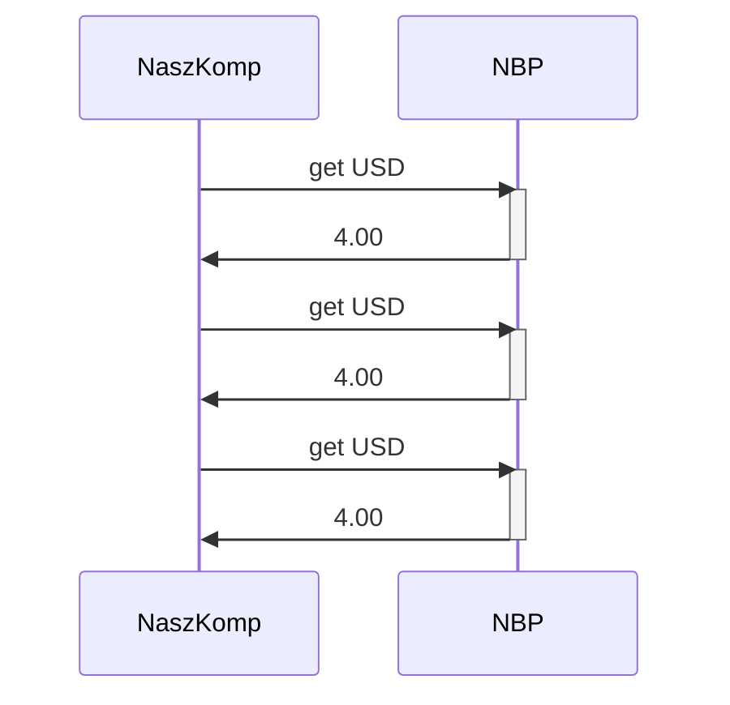
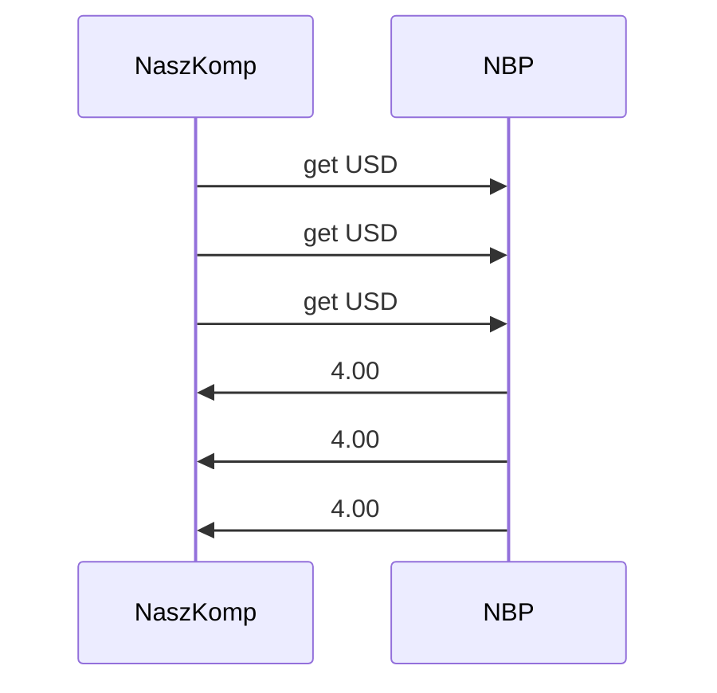

## synchroniczne wysyłanie requestów:

```mermaid
sequenceDiagram
NaszKomp->>NBP: get USD
activate NBP
NBP->>NaszKomp: 4.00
deactivate NBP
NaszKomp->>NBP: get USD
activate NBP
NBP->>NaszKomp: 4.00
deactivate NBP
NaszKomp->>NBP: get USD
activate NBP
NBP->>NaszKomp: 4.00
deactivate NBP
```

## asynchroniczne wysyłanie requestów:

```mermaid
sequenceDiagram
NaszKomp->>NBP: get USD
NaszKomp->>NBP: get USD
NaszKomp->>NBP: get USD

NBP->>NaszKomp: 4.00
NBP->>NaszKomp: 4.00
NBP->>NaszKomp: 4.00
```